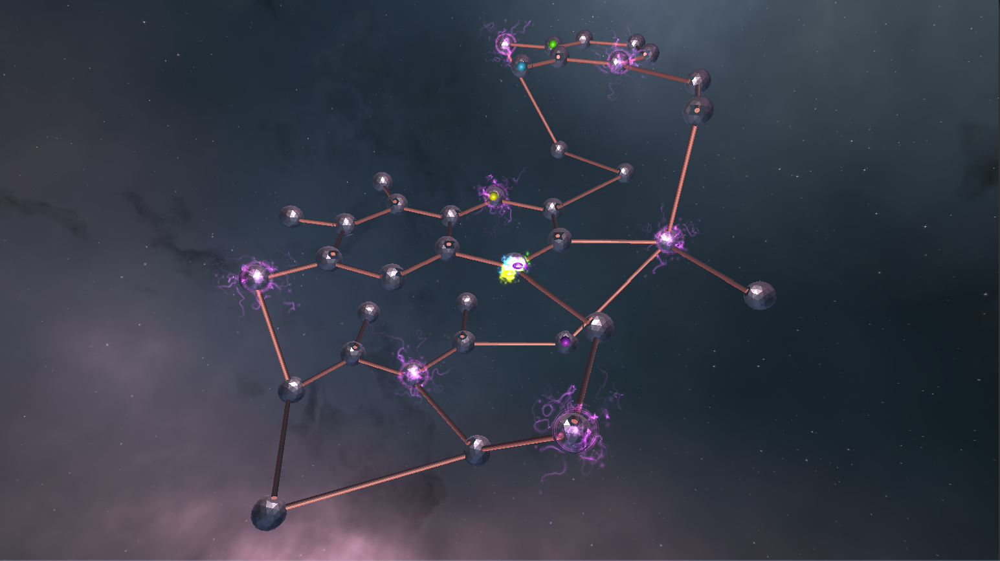
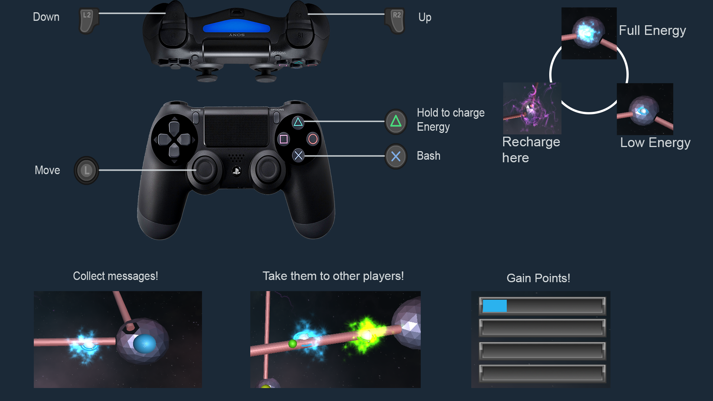

# Message Runner

  

This is a HAW GameJam 4-player couch co-op game, developed in one week. The topic was "Die spinnen, die Jugendlichen...".  

For each player a message in their player-color is spawned in the abstract form of a sphere. When a player collects their message a smaller sphere, indicating  the color of the receiver of this message, is following them.  Score points by delivering the message to the correct receiver.  

  

Playable with Xbox and Playstation Controllers.  
You can choose a default color selection for each player when pressing 5.  

## Asset-Sources  
- Backgroundmusic (CC0) - http://freemusicarchive.org/music/Loyalty_Freak_Music/
- Soundeffect (CC0) - https://freesound.org/people/Dneproman/sounds/334716/
- Soundeffect https://opengameart.org/content/level-up-power-up-coin-get-13-sounds

You can find more information here:  
https://c4rina.itch.io/message-runner